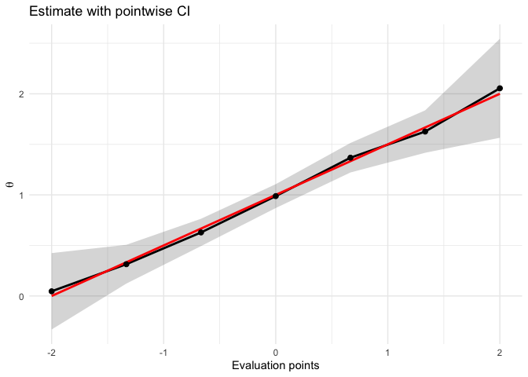

# drl.cate

[](../../actions/workflows/R-CMD-check.yaml)
[](https://app.codecov.io/gh/matteobonvini/drl.cate)
[](https://lifecycle.r-lib.org/articles/stages.html)
[](LICENSE)

An R package for **doubly robust learners of conditional average
treatment effects (CATEs)**.  
It provides implementations of debiased/regularized machine learning
methods for heterogeneous treatment effect estimation.

> *Note*: This README is generated with the help of ChatGPT.

## Installation

``` r
# install.packages("devtools")
devtools::install_github("matteobonvini/drl.cate")
```

## Example

``` r
# Minimal working example for drl.cate::cate()

# If not installed yet:
# devtools::install_github("matteobonvini/drl.cate")

library(drl.cate)
library(SuperLearner)
```

    ## Loading required package: nnls

    ## Loading required package: gam

    ## Loading required package: splines

    ## Loading required package: foreach

    ## Loaded gam 1.22-5

    ## Super Learner

    ## Version: 2.0-29

    ## Package created on 2024-02-06

``` r
set.seed(102025)
n <- 2000; p <- 5
X <- matrix(rnorm(n * p), n, p)
colnames(X) <- paste0("X", 1:p)

# Treatment depends on X1 and X2
A <- rbinom(n, 1, plogis(0.5 * X[, 1] - 0.5 * X[, 2]))

# True CATE depends on X1
tau_true <- 1 + 0.5 * X[, 1]
Y <- tau_true * A + X[, 1] - X[, 2] + rnorm(n)

df <- data.frame(Y = Y, A = A, X)

x_names <- paste0("X", 1:p)   # confounders
y_name  <- "Y"
a_name  <- "A"
v_names <- "X1"               # effect modifier(s)

# Evaluation grid for CATE(V = v0)
v0 <- matrix(seq(from = -2, to = 2, length.out = 7), ncol = 1)
colnames(v0) <- v_names

# ---------- Nuisance and stage-2 wrapper functions ----------

pi.x <- function(a, x, new.x) {
  SL.lib <- c("SL.mean", "SL.lm", "SL.glm")
  model <- SuperLearner::SuperLearner(Y = a,
                                      X = x,
                                      newX = new.x,
                                      family = binomial(),
                                      SL.library = SL.lib)
  fit <- function(new.x) {
    out <- predict.SuperLearner(model, newdata = new.x)$pred[, 1]
    out[out < 0.01] <- 0.01
    out[out > 0.99] <- 0.99
    return(out)
  }
  preds.tr <- model$SL.predict[, 1]
  preds.tr[preds.tr < 0.01] <- 0.01
  preds.tr[preds.tr > 0.99] <- 0.99
  return(list(res = preds.tr, model = model, fit = fit))
}

mu1.x <- function(y, a, x, new.x) {
  SL.lib <- c("SL.mean", "SL.lm", "SL.glm")
  model <- SuperLearner::SuperLearner(Y = y[a == 1],
                                      X = x[a == 1, , drop = FALSE],
                                      newX = new.x,
                                      SL.library = SL.lib)
  fit <- function(new.x) predict.SuperLearner(model, newdata = new.x)$pred[, 1]
  return(list(res = model$SL.predict[, 1], model = model, fit = fit))
}

mu0.x <- function(y, a, x, new.x) {
  SL.lib <- c("SL.mean", "SL.lm", "SL.glm")
  model <- SuperLearner::SuperLearner(Y = y[a == 0],
                                      X = x[a == 0, , drop = FALSE],
                                      newX = new.x,
                                      SL.library = SL.lib)
  fit <- function(new.x) predict.SuperLearner(model, newdata = new.x)$pred[, 1]
  return(list(res = model$SL.predict[, 1], model = model, fit = fit))
}

# specify second-stage regression
# the NAs are just place holders in case in the future we return upper and lower
# confidence bands.
# specify second-stage regression to compute ITEs. E(Y_1 - Y_0 | V_i)
drl.x <- function(pseudo, x, new.x) {
  SL.lib <- c("SL.mean", "SL.lm", "SL.glm")
  model <- SuperLearner::SuperLearner(Y = pseudo,
                                      X = x,
                                      newX = new.x,
                                      family = gaussian(),
                                      SL.library = SL.lib)
  fit <- function(new.x) predict.SuperLearner(model, newdata = new.x)$pred[, 1]
  out <- cbind(model$SL.predict[, 1], NA, NA)
  return(list(res = out, model = model, fit = fit))
}

drl.v <- function(pseudo, v, new.v) {
  SL.lib <- c("SL.mean", "SL.lm", "SL.glm")
  model <- SuperLearner::SuperLearner(Y = pseudo,
                                      X = v,
                                      newX = new.v,
                                      family = gaussian(),
                                      SL.library = SL.lib)
  fit <- function(new.x) predict.SuperLearner(model, newdata = new.v)$pred[, 1]
  out <- cbind(model$SL.predict[, 1], NA, NA)
  return(list(res = out, model = model, fit = fit))
}

# --------------------------- Run learner ---------------------------

out <- cate(
  data    = df,
  learner = "dr",
  x_names = x_names,
  y_name  = y_name,
  a_name  = a_name,
  v_names = v_names,
  v0      = v0,
  mu1.x = mu1.x, mu0.x = mu0.x, pi.x = pi.x,
  drl.v = drl.v, drl.x = drl.x,
  bw.stage2=c(0.5, 1, 1.5),
  nsplits = 2, 
  univariate_reg = TRUE,
)
```

    ## [1] "Considering split # 1 out of 2"
    ## [1] "Considering split # 2 out of 2"
    ## [1] "Done with fitting nuisance functions."

``` r
library(ggplot2)
res <- out$univariate.res$dr[[1]]$res

# Turn whatever you have into a data.frame
df <- as.data.frame(res)

# Standardize column names so ggplot can find them reliably
# (convert dots to underscores and normalize debias/pts suffixes)
nm <- names(df)
nm_std <- nm |>
  gsub("\\.debias$", "_debias", x = _) |>
  gsub("\\.pts$", "_pts", x = _) |>
  gsub("\\.", "_", x = _)
names(df) <- nm_std
# After this, we expect columns like:
# eval_pts, theta, theta_debias, ci_ul_pts, ci_ll_pts, ci_ul_pts_debias, ci_ll_pts_debias

# Sanity check: error early if required cols missing
req <- c("eval_pts","theta","ci_ll_pts","ci_ul_pts")
missing <- setdiff(req, names(df))
if (length(missing)) {
  stop("Missing columns in est_array after renaming: ", paste(missing, collapse = ", "))
}

# 1) Theta with pointwise CI ribbon
p_theta <- ggplot(df, aes(x = eval_pts, y = theta)) +
  geom_ribbon(aes(ymin = ci_ll_pts, ymax = ci_ul_pts), alpha = 0.2) +
  geom_line(linewidth = 1) +
  geom_line(aes(x=eval_pts, y=1 + 0.5 * eval_pts), linewidth = 1, col="red") +
  geom_point(size = 2) +
  labs(x = "Evaluation points", y = expression(theta),
       title = "Estimate with pointwise CI") +
  theme_minimal()

p_theta
```

<!-- -->

## Documentation

- Function reference: `?cate`  
- Vignettes (coming soon) will demonstrate end-to-end workflows.

## Contributing

Contributions are welcome! Please open an issue or submit a pull
request.  
Before submitting, run `devtools::check()` and the test suite via
`devtools::test()`.

## License

This package is released under the [MIT License](LICENSE).
